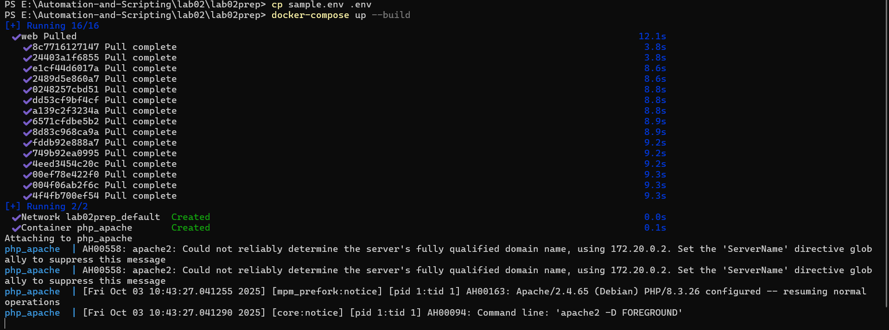
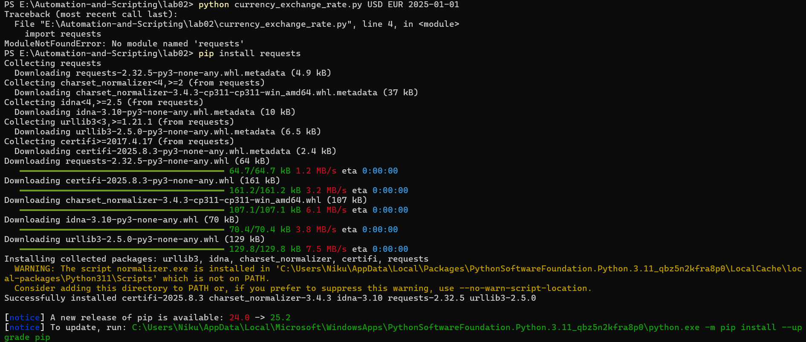
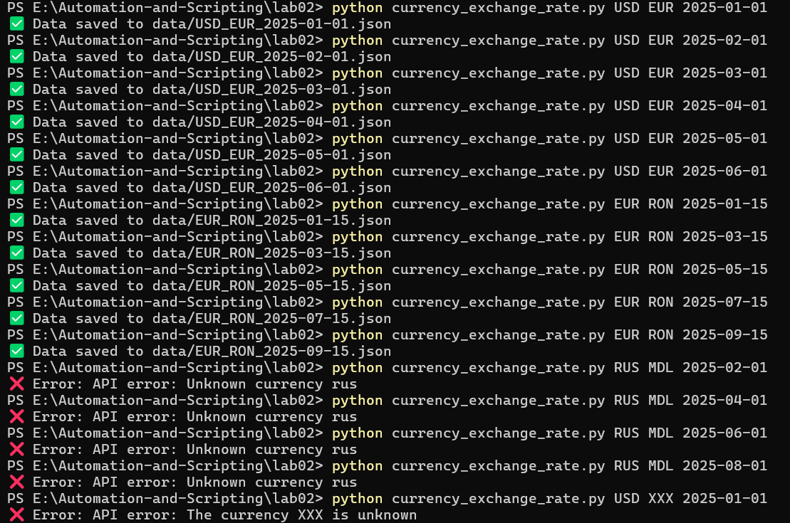

# IW02: Creating a Python Script to Interact with an API

### Scopul lucararii:

Învață să interacționezi cu un API pe Web folosind un script Python.

### Pregătire

Descărcați proiectul atașat acestei sarcini și despachetați-l într-o locație convenabilă. Începeți serviciul utilizând instrucțiunile din README.md - Dosar.

### Sarcina

În automationproiect, creează o ramură numită lab02. . Creeaza un director numit lab02. . În interiorul acestuia, creați un fișier numit currency_exchange_rate.py. .

Scrie un scenariu Python (currency_exchange_rate.py) vor interacționa cu API-ul de servicii. Scriptul trebuie să îndeplinească următoarele funcții:

1. Obțineți cursul de schimb al unei monede față de altul la o dată specificată. Monedele și data trebuie să fie trecute ca parametri de linie de comandă.
2. Salvați datele primite la un fișier în format JSON. Numele fișierului trebuie să includă monedele și data cererii. Salvează fișierul într-un dataDirectory, care trebuie creat în rădăcina proiectului dacă nu există deja.
3. Manipulați erorile care apar atunci când faceți cereri la API (de exemplu, parametrii nevalizi). Afișați mesajele de eroare clare din consolă și salvați-le la un fișier de jurnal error.logÎn rădăcina proiectului.

Testați scriptul rulând-o cu parametri diferiți. Perioada de date: de la 2025-01-01la 2025-09-15. .

Rulați scriptul pentru datele din gama aleasă (cel puțin 5 întâlniri, cu intervale egale).

## Execuție

Descarcam zip file il dezarhivăm și daca dorim schimbăm API_KEY din fișierul sample.env si pornim dockerul apoi executam comanda:

    cp sample.env .env

La mine pe portul 8080 deja lucreaza baza de date pentru alt proiect de aceea in docker-compose schimb portul pe 8888

Apoi putem construi containerul pe baza docker compose cu comanda:

    docker-compose up --build



Controlam daca lucreaza API cu comanda: 

    curl "http://localhost:8888/?currencies" -Method POST -Body "key=NICU_LUPU_API_KEY"
"


Daca vedem mesaj ca pe imagine atuci totul e ok

Acum e timpul sa facem fisierul ```currency_exchange_rate.py```

Cu continutul:

    import os
    import sys
    import json
    import requests
    from datetime import datetime

    def main():
        API_KEY = "NICU_LUPU_API_KEY"

        if len(sys.argv) != 4:
            print("Usage: python currency_exchange_rate.py <from_currency> <to_currency> <date: YYYY-MM-DD>")
            sys.exit(1)

        from_currency = sys.argv[1].upper()
        to_currency = sys.argv[2].upper()
        date = sys.argv[3]

        # validăm formatul datei
        try:
            datetime.strptime(date, "%Y-%m-%d")
        except ValueError:
            log_error(f"Invalid date format: {date}. Expected YYYY-MM-DD.")
            sys.exit(1)

        # endpoint API
        url = "http://localhost:8888/"
        params = {"from": from_currency, "to": to_currency, "date": date}
        data = {"key": API_KEY}

        try:
            response = requests.post(url, params=params, data=data, timeout=10)
            response.raise_for_status()
            result = response.json()

            if result.get("error"):
                log_error(f"API error: {result['error']}")
                sys.exit(1)

            # salvăm datele în fișier JSON
            os.makedirs("data", exist_ok=True)
            filename = f"data/{from_currency}_{to_currency}_{date}.json"
            with open(filename, "w", encoding="utf-8") as f:
                json.dump(result, f, indent=4, ensure_ascii=False)

            print(f"✅ Data saved to {filename}")

        except requests.exceptions.RequestException as e:
            log_error(f"Request failed: {e}")
            sys.exit(1)
        except ValueError as e:
            log_error(f"Invalid JSON response: {e}")
            sys.exit(1)


    def log_error(message: str):
        print(f"❌ Error: {message}")
        with open("error.log", "a", encoding="utf-8") as f:
            f.write(f"{datetime.now().isoformat()} - {message}\n")


    if __name__ == "__main__":
        main()

Acum incercam sa pornim codul cu comanda:

    python currency_exchange_rate.py USD EUR 2025-01-01



Observam ca nu functioneaza si trebuie de instalat dependentele cu comanda:

    pip install requests 

Incercam inca o data si observam ca totul functioneaza



## Raspuns la intrebari:

* Cum se instalează dependențele necesare pentru a rula scriptul;
    
    Ai nevoie de Python 3.8+

* Cum se execută scriptul cu exemple de comandă;

    Penrtru a executa comenzi folosim machetul: 
        ```python currency_exchange_rate.py <FROM_CURRENCY> <TO_CURRENCY> <DATE>```

    Exemple:

    USD → EUR la 01.01.2025
            ```python currency_exchange_rate.py USD EUR 2025-01-01```
    EUR → MDL la 05.03.2024
            ```python currency_exchange_rate.py EUR MDL 2024-03-05```
    Rezultatele se salvează automat în folderul data/ cu nume de fișier de tip:
        ```data/USD_EUR_2025-01-01.json```
* Cum este structurat scenariul (funcții și logica principală).
    Scriptul are următoarea logică:

    fetch_exchange_rate(from_currency, to_currency, date)
    * Face request către API și întoarce datele JSON cu cursul valutar.

    save_to_file(data, from_currency, to_currency, date)
    * Creează folderul data/ și salvează răspunsul într-un fișier JSON.

    main()

    * Primește argumentele din linia de comandă (valuta sursă, valuta țintă, data).

    * Apelează fetch_exchange_rate() ca să ia datele.

    * Apelează save_to_file() ca să salveze rezultatul.

    * Gestionează erorile (ex: coduri valutare greșite, lipsă conexiune).