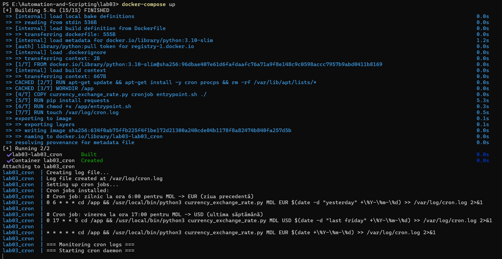
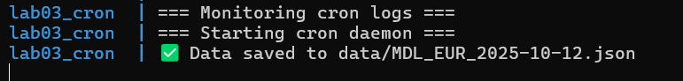
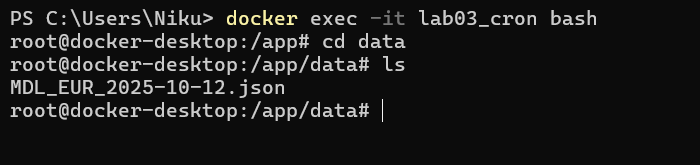
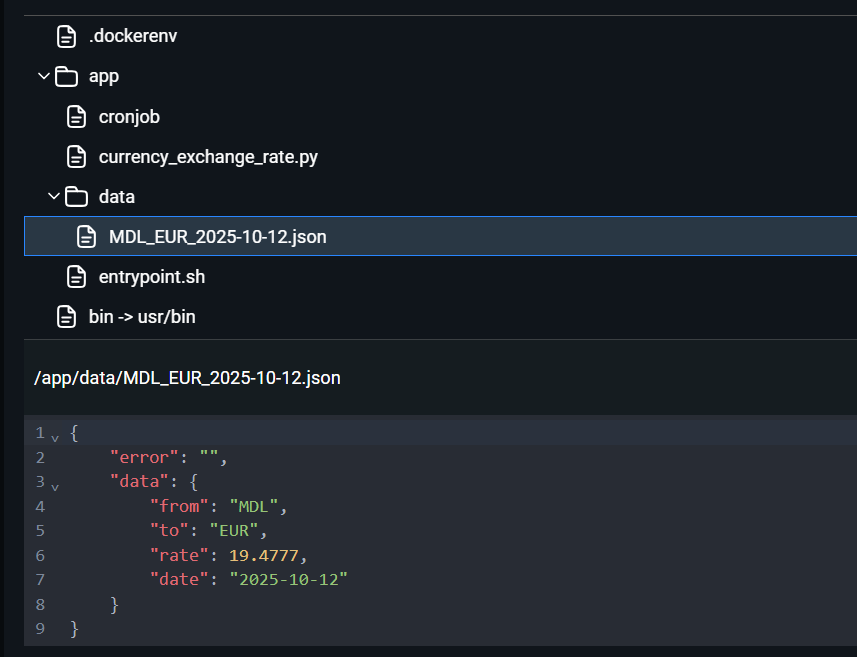
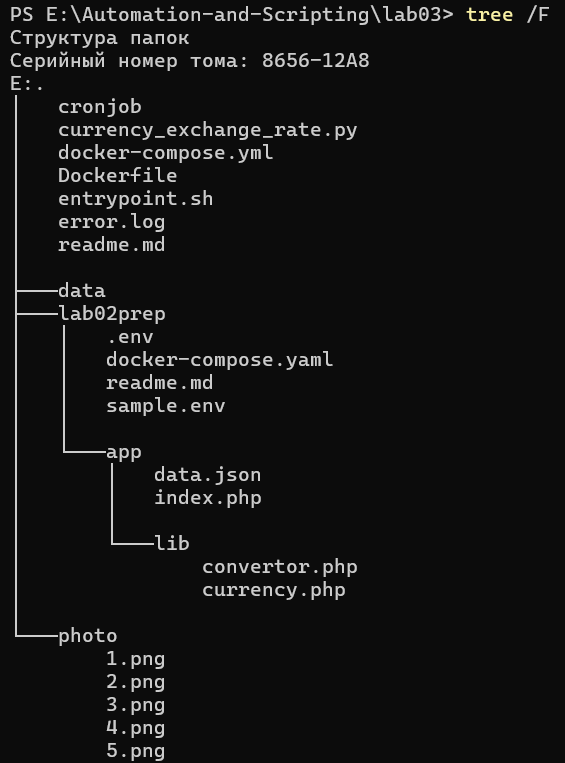

# IW03: Program de activități (cron) Configurație

### Scopul lucararii:

Aflați cum să configurați programatorul (cronul) pentru executarea automată a scriptului.

### Pregătire

Această misiune se bazează pe munca de laborator nr. 2. Copiați fișierele de la lucrarea de laborator nr. 2 la un nou director lab03Pentru mai multe lucrări.

### Sarcina

În automationproiect, creați o ramură lab03. . Creează un director lab03și să copieze fișiere de la locul de muncă nr. 2 (folder lab02) acolo.

În lab03Directory, creați un fișier cronjob. . În acest fișier, specificați sarcinile crone care vor rula scriptul currency_exchange_rate.py: :

* Zilnic la ora 6:00 AM pentru a obține MDL la cursul de schimb EUR pentru ziua precedentă.
* Săptămânal, vineri, la ora 5:00 PM, pentru a obține cursul de schimb MDL la USD pentru săptămâna precedentă.

Creează o Dockerfileîn lab03director, bazat pe Ubuntu sau imaginea oficială Python, care va:

* Instalați dependențele necesare pentru a rula scriptul (cron, Python și bibliotecile necesare).
* Copiază scenariul currency_exchange_rate.py, cronjobfișierul și scriptul de intrare în recipient.
* Configurați cronul pentru a executa sarcini specificate în cronjob- Dosar.
* Rulați cron în modul de fundal atunci când începe recipientul.
* Scrieți ieșirea de sarcină a coroanei la fișier /var/log/cron.log. .

Pentru o muncă mai ușoară cu cronul, este recomandat să utilizați un script de entrypoint care va configura și începe corona. Un exemplu de astfel de script este prezentat mai jos:

    #!/bin/sh

    create_log_file() {
        echo "Creating log file..."
        touch /var/log/cron.log
        chmod 666 /var/log/cron.log
        echo "Log file created at /var/log/cron.log"
    }

    monitor_logs() {
        echo "=== Monitoring cron logs ==="
        tail -f /var/log/cron.log
    }

    run_cron() {
        echo "=== Starting cron daemon ==="
        exec cron -f
    }

    env > /etc/environment
    create_log_file
    monitor_logs &
    run_cron

Creează o docker-compose.ymlfișier în lab03Director care va folosi Dockerfile creat pentru a construi imaginea și a rula containerul.

## Execuție

Copiem toate fisierele din lab02, apoi creem fisierul de configuratie a cron cu continutul:

    0 6 * * * cd /app && /usr/local/bin/python3 currency_exchange_rate.py MDL EUR $(date -d "yesterday" +\%Y-\%m-\%d) >> /var/log/cron.log 2>&1

    0 17 * * 5 cd /app && /usr/local/bin/python3 currency_exchange_rate.py MDL USD $(date -d "last friday" +\%Y-\%m-\%d) >> /var/log/cron.log 2>&1

    * * * * * cd /app && /usr/local/bin/python3 currency_exchange_rate.py MDL EUR $(date +\%Y-\%m-\%d) >> /var/log/cron.log 2>&1

Pimele 2 linii sunt pentru a indeplini sarcina laboratotului si am mai adaugat o conditie pentru test care va extrage cursul fiecare minut.

Apoi creem fisierul `entrypoint.sh` cu continutul:

    #!/bin/sh

    create_log_file() {
        echo "Creating log file..."
        touch /var/log/cron.log
        chmod 666 /var/log/cron.log
        echo "Log file created at /var/log/cron.log"
    }

    setup_cron() {
        echo "Setting up cron jobs..."
        crontab /app/cronjob
        echo "Cron jobs installed:"
        crontab -l
    }

    monitor_logs() {
        echo "=== Monitoring cron logs ==="
        tail -f /var/log/cron.log &
    }

    run_cron() {
        echo "=== Starting cron daemon ==="
        exec cron -f
    }

    env > /etc/environment
    create_log_file
    setup_cron
    monitor_logs
    run_cron

Dupa pregatirile legate de cron trebuie sa facem containerul in care totul se va executa. Pentru aceasta facem un Dockerfile cu continutul:

FROM python:3.10-slim

    # Instalăm cron și procps (pentru comanda ps)
    RUN apt-get update && apt-get install -y cron procps && rm -rf /var/lib/apt/lists/*

    # Setăm directorul de lucru
    WORKDIR /app

    # Copiem fișierele necesare
    COPY currency_exchange_rate.py cronjob entrypoint.sh ./

    # Instalăm dependențele Python
    RUN pip install requests

    # Permisiuni pentru scripturi
    RUN chmod +x /app/entrypoint.sh

    # Expunem logul cronului
    RUN touch /var/log/cron.log

    # Pornim containerul
    ENTRYPOINT ["/app/entrypoint.sh"]

Apoi facem si fisierul docker-compose cu continutul:

    services:
    lab03_cron:
        build: .
        container_name: lab03_cron
        network_mode: "host"
        volumes:
        - ./data:/app/data
        environment:
        API_KEY: "NICU_LUPU_API_KEY"
        restart: unless-stopped

**Inainte de a porni containerul nu uitam sa pornim API din lab 2**

Construim si pornim containerul cu comanda `docker-compose up`

 
Acum asteptam un minut ca sa vedem daca totul functioneaza

Observam mesajul setat in fisierul py aceasta inseamna ca totul sa salvat si putem controla daca am prinit datele.

Intram in container si ne uitam daca este fisierul

Deoarece in imaginea noastra nu avem nimic ce ne va permite sa citim acest fisier si pentru a nu instala nimic prin programul Docker putem privi ce e in el

Observam ca totul sa salvat inseamna ca totul functioneaza

## Raspuns la intrebari

* Cum se construiește și se rulează containerul cu cron

    Containerul se construiește pe baza fișierului `Dockerfile`, care instalează Python și configurează serviciul cron pentru a rula sarcini programate.
    Rularea se face cu comanda `docker-compose up`, care creează containerul și pornește automat procesul cron în fundal, conform configurației din `entrypoint.sh` și `cronjob`.

* Cum se verifică dacă sarcinile de cronare execută și ieșirea este scrisă la fișierul `/var/log/cron.log`

    Execuția sarcinilor cron se verifică prin consultarea fișierului de log din container: `/var/log/cron.log`. Dacă cronul funcționează corect, în log apar mesajul setat di fisierul py care indica ca el arulat corect.

* Descrierea structurii proiectului și scopul fiecărui fișier

    

    In imagine observam structura proiectului unde:
    * cronjob - Conține programarea sarcinilor cron,
    * entrypoint.sh - Scriptul care configurează cron, adaugă sarcinile din cronjob și pornește daemonul cron.
    * Dockerfile - Definește mediul de execuție: instalează Python, cron și copiază fișierele necesare în container.
    * docker-compose.yml - Specifică serviciile care vor fi pornite, volumele și modul de rețea folosit.
    * currency_exchange_rate.py - Scriptul care apelează API-ul de schimb valutar și salvează rezultatele în format JSON.
    * data - Directorul în care sunt salvate fișierele JSON generate de cron.
    * error.log - Log pentru eventualele erori apărute în timpul execuției. Ramas de la lab 2.
    