# IWNO05: Playbook Ansible pentru Configurarea Serverului

## Obiectiv

Învață să creezi playbook-uri Ansible pentru automatizarea configurației serverului.

## Cerințe Preliminare

Această temă se bazează pe Lucrarea Individuală IW04.

Creează un folder `lab05` în repository-ul tău GitHub pentru a stoca toate fișierele legate de această lucrare individuală. Trebuie să ai Docker și Docker Compose instalate pentru a completa această temă. De asemenea, ar trebui să ai un repository cu un proiect PHP care conține teste unitare, ca în Lucrarea Individuală IW04.

Copiază fișierele din lucrarea individuală anterioară `lab04` în folderul `lab05`.

## Implementarea Proiectului

Începând implementarea, am organizat structura proiectului prin crearea directorelor necesare. Am stabilit folderul `ansible/` pentru a stoca playbook-urile și fișierul de inventar, precum și directorul `pipelines/` unde am plasat toate pipeline-urile Jenkins în format Groovy. Aceste directoare au fost esențiale pentru organizarea codului și pentru facilitarea montării volumelor în containerele Docker.

Pentru autentificarea între componente, am folosit cheile SSH existente și am generat două perechi noi de chei SSH. 

Prima pereche de chei (`jenkins_agent_ssh_key` și `jenkins_agent_ssh_key.pub`) deja existentă din lab4


A doua pereche (`jenkins_ansible_ssh_key` și `jenkins_ansible_ssh_key.pub`) a fost necesară pentru conectarea Jenkins Controller la agentul Ansible.

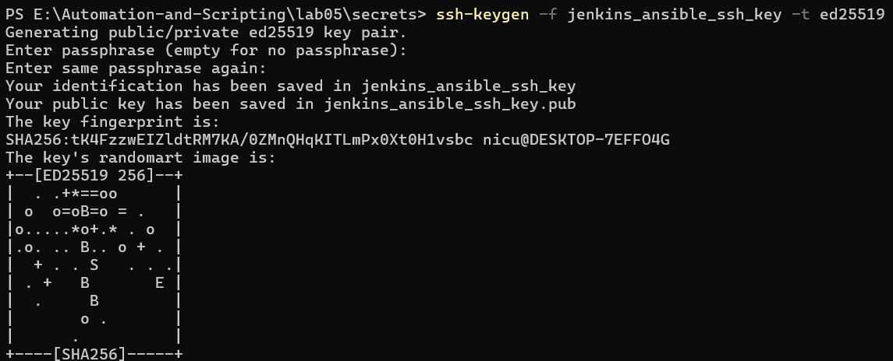

 În plus, am generat o pereche de chei (`ansible_test_server_key` și `ansible_test_server_key.pub`) pentru a permite agentului Ansible să se conecteze la serverul de test. 

 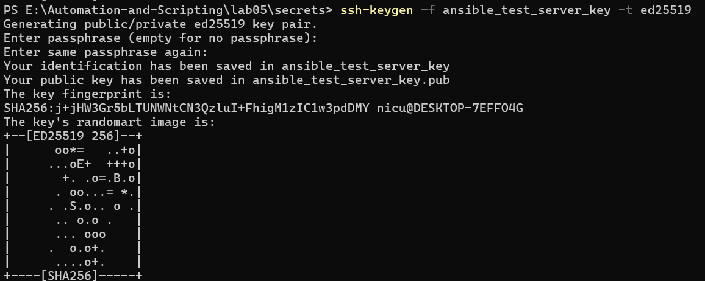
 
 Toate aceste chei au fost plasate în directorul `secrets/` pentru o gestionare centralizată și sigură.

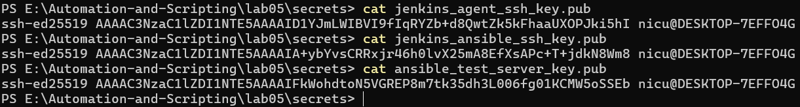

Primul fișier pe care l-am definit a fost `compose.yaml`, care orchestrează toate serviciile Docker necesare pentru infrastructură. Acest fișier definește patru servicii principale: `jenkins-controller` (folosind imaginea oficială Jenkins LTS), `ssh-agent` (construit din Dockerfile personalizat), `ansible-agent` (construit din Dockerfile personalizat) și `test-server` (construit din Dockerfile personalizat). Fiecare serviciu are configurat porturile necesare, volume-urile pentru persistența datelor, rețeaua Docker comună și dependențele între servicii. Portul pentru Jenkins Controller a fost setat la 8081 pentru a evita conflictele cu alte servicii, iar portul pentru test-server la 8082 pentru același motiv.

```yaml
services:
  jenkins-controller:
    image: jenkins/jenkins:lts
    container_name: jenkins-controller
    hostname: jenkins-controller
    ports:
      - "8081:8080"
      - "50000:50000"
    volumes:
      - jenkins_home:/var/jenkins_home
    networks:
      jenkins-network:
        aliases:
          - jenkins-controller
    restart: unless-stopped

  ssh-agent:
    build:
      context: .
      dockerfile: Dockerfile.ssh_agent
    container_name: ssh-agent
    hostname: ssh-agent
    environment:
      - JENKINS_AGENT_SSH_PUBKEY=${JENKINS_AGENT_SSH_PUBKEY}
    volumes:
      - jenkins_agent_volume:/home/jenkins/agent
    depends_on:
      - jenkins-controller
    networks:
      jenkins-network:
        aliases:
          - ssh-agent
    restart: unless-stopped

  ansible-agent:
    build:
      context: .
      dockerfile: Dockerfile.ansible_agent
    container_name: ansible-agent
    hostname: ansible-agent
    environment:
      - JENKINS_AGENT_SSH_PUBKEY=${JENKINS_ANSIBLE_SSH_PUBKEY}
    volumes:
      - jenkins_ansible_volume:/home/jenkins-ansible/agent
      - ./ansible:/home/jenkins-ansible/ansible:ro
    depends_on:
      - jenkins-controller
      - test-server
    networks:
      jenkins-network:
        aliases:
          - ansible-agent
    restart: unless-stopped

  test-server:
    build:
      context: .
      dockerfile: Dockerfile.test_server
    container_name: test-server
    hostname: test-server
    ports:
      - "8082:80"
      - "2222:22"
    volumes:
      - test_server_www:/var/www/html
    networks:
      jenkins-network:
        aliases:
          - test-server
    restart: unless-stopped

volumes:
  jenkins_home:
  jenkins_agent_volume:
  jenkins_ansible_volume:
  test_server_www:

networks:
  jenkins-network:
    driver: bridge
```

Următorul fișier pe care l-am dezvoltat a fost `Dockerfile.ssh_agent`, care extinde imaginea oficială `jenkins/ssh-agent` și adaugă toate dependențele necesare pentru construirea și testarea proiectului PHP. Acest Dockerfile instalează PHP CLI, extensiile PHP necesare (xml, curl, mbstring, zip, dom), Git, curl, unzip și Composer. La final, verifică instalarea corectă a tuturor componentelor.

```dockerfile
FROM jenkins/ssh-agent

RUN apt-get update && apt-get install -y \
    php-cli \
    php-xml \
    php-curl \
    php-mbstring \
    php-zip \
    php-dom \
    git \
    curl \
    unzip \
    && rm -rf /var/lib/apt/lists/*

RUN curl -sS https://getcomposer.org/installer | php -- --install-dir=/usr/local/bin --filename=composer \
    && chmod +x /usr/local/bin/composer

RUN php --version && composer --version && git --version && php -m | grep -E "(dom|curl|xml)"
```

Pentru agentul Ansible, am construit `Dockerfile.ansible_agent` pe baza imaginii Ubuntu latest. Acest Dockerfile instalează Python3, pip, OpenSSH server și client, Git, curl, sudo, Java Runtime Environment (necesar pentru Jenkins agents), rsync și Ansible. Apoi creează utilizatorul `jenkins-ansible` (cu nume diferit pentru identificare ușoară în Jenkins), configurează directorul `.ssh` cu permisiunile corecte, copiază cheia publică SSH pentru conectarea Jenkins și cheile SSH pentru conectarea la test-server. Configurează SSH server-ul pentru a accepta doar autentificare bazată pe chei și pornește serviciul SSH pentru a permite conexiunile.

```dockerfile
FROM ubuntu:latest

RUN apt-get update && apt-get install -y \
    python3 \
    python3-pip \
    openssh-server \
    openssh-client \
    git \
    curl \
    sudo \
    openjdk-17-jre-headless \
    rsync \
    && rm -rf /var/lib/apt/lists/*

RUN pip3 install --no-cache-dir --break-system-packages ansible

RUN useradd -m -s /bin/bash jenkins-ansible

RUN mkdir -p /home/jenkins-ansible/.ssh && \
    chmod 700 /home/jenkins-ansible/.ssh && \
    chown -R jenkins-ansible:jenkins-ansible /home/jenkins-ansible/.ssh

COPY secrets/jenkins_ansible_ssh_key.pub /tmp/jenkins_key.pub
RUN cat /tmp/jenkins_key.pub > /home/jenkins-ansible/.ssh/authorized_keys && \
    chmod 600 /home/jenkins-ansible/.ssh/authorized_keys && \
    chown jenkins-ansible:jenkins-ansible /home/jenkins-ansible/.ssh/authorized_keys && \
    rm /tmp/jenkins_key.pub

RUN mkdir -p /home/jenkins-ansible/ansible && \
    chown -R jenkins-ansible:jenkins-ansible /home/jenkins-ansible/ansible

COPY secrets/ansible_test_server_key /home/jenkins-ansible/.ssh/id_rsa
COPY secrets/ansible_test_server_key.pub /home/jenkins-ansible/.ssh/id_rsa.pub
RUN chmod 600 /home/jenkins-ansible/.ssh/id_rsa && \
    chmod 644 /home/jenkins-ansible/.ssh/id_rsa.pub && \
    chown jenkins-ansible:jenkins-ansible /home/jenkins-ansible/.ssh/id_rsa /home/jenkins-ansible/.ssh/id_rsa.pub

RUN mkdir /var/run/sshd && \
    sed -i 's/#PermitRootLogin prohibit-password/PermitRootLogin no/' /etc/ssh/sshd_config && \
    sed -i 's/#PasswordAuthentication yes/PasswordAuthentication no/' /etc/ssh/sshd_config && \
    sed -i 's/#PubkeyAuthentication yes/PubkeyAuthentication yes/' /etc/ssh/sshd_config && \
    echo "PubkeyAuthentication yes" >> /etc/ssh/sshd_config

EXPOSE 22

RUN mkdir -p /home/jenkins-ansible/agent && \
    chmod 755 /home/jenkins-ansible/agent && \
    chown jenkins-ansible:jenkins-ansible /home/jenkins-ansible/agent

WORKDIR /home/jenkins-ansible/agent

USER jenkins-ansible
RUN ansible --version

USER root

CMD ["sh", "-c", "/usr/sbin/sshd -D & sleep infinity"]
```

Serverul de test a fost definit prin `Dockerfile.test_server`, care instalează OpenSSH server, sudo și rsync pe o imagine Ubuntu. Creează utilizatorul `ansible` cu permisiuni sudo fără parolă, configurează directorul `.ssh` și adaugă cheia publică SSH în `authorized_keys`. Configurează SSH pentru a accepta doar autentificare bazată pe chei și pornește serviciul SSH.

```dockerfile
FROM ubuntu:latest

RUN apt-get update && apt-get install -y \
    openssh-server \
    sudo \
    rsync \
    && rm -rf /var/lib/apt/lists/*

RUN useradd -m -s /bin/bash ansible && \
    echo "ansible ALL=(ALL) NOPASSWD:ALL" >> /etc/sudoers

RUN mkdir -p /home/ansible/.ssh && \
    chmod 700 /home/ansible/.ssh && \
    chown -R ansible:ansible /home/ansible/.ssh

COPY secrets/ansible_test_server_key.pub /tmp/ansible_key.pub
RUN cat /tmp/ansible_key.pub >> /home/ansible/.ssh/authorized_keys && \
    chmod 600 /home/ansible/.ssh/authorized_keys && \
    chown ansible:ansible /home/ansible/.ssh/authorized_keys && \
    rm /tmp/ansible_key.pub

RUN mkdir /var/run/sshd && \
    sed -i 's/#PermitRootLogin prohibit-password/PermitRootLogin no/' /etc/ssh/sshd_config && \
    sed -i 's/#PasswordAuthentication yes/PasswordAuthentication no/' /etc/ssh/sshd_config && \
    sed -i 's/#PubkeyAuthentication yes/PubkeyAuthentication yes/' /etc/ssh/sshd_config && \
    echo "PubkeyAuthentication yes" >> /etc/ssh/sshd_config

EXPOSE 22

CMD ["/usr/sbin/sshd", "-D"]
```

În directorul `ansible/`, am stabilit fișierul `hosts.ini` care definește inventarul Ansible pentru serverul de test. Acest fișier specifică hostname-ul, utilizatorul și calea către cheia privată SSH pentru conectare.

```ini
[test_servers]
test-server ansible_host=test-server ansible_user=ansible ansible_ssh_private_key_file=/home/jenkins-ansible/.ssh/id_rsa

[test_servers:vars]
ansible_ssh_common_args='-o StrictHostKeyChecking=no'
```

Playbook-ul principal Ansible `ansible/setup_test_server.yml` configurează serverul de test cu Apache și PHP. Acest playbook actualizează cache-ul apt, instalează Apache2, PHP și toate extensiile necesare (xml, curl, mbstring, mysql, zip, gd, bcmath), instalează Composer, activează modulele Apache necesare (rewrite și php8.1), creează directorul document root, configurează virtual host-ul Apache, pornește serviciul Apache folosind comanda `service` (pentru compatibilitate cu containerele Docker) și creează un fișier PHP pentru testare.

```yaml
---
- name: Configure Test Server with Apache and PHP
  hosts: test_servers
  become: yes
  become_user: root
  
  tasks:
    - name: Update apt cache
      apt:
        update_cache: yes
        cache_valid_time: 3600

    - name: Install Apache2
      apt:
        name: apache2
        state: present

    - name: Install PHP and required extensions
      apt:
        name:
          - php
          - php-cli
          - php-common
          - php-mysql
          - php-zip
          - php-gd
          - php-mbstring
          - php-curl
          - php-xml
          - php-bcmath
          - libapache2-mod-php
          - curl
          - unzip
        state: present

    - name: Install Composer
      shell: |
        curl -sS https://getcomposer.org/installer | php
        mv composer.phar /usr/local/bin/composer
        chmod +x /usr/local/bin/composer
      args:
        creates: /usr/local/bin/composer

    - name: Enable Apache modules
      apache2_module:
        name: "{{ item }}"
        state: present
      loop:
        - rewrite
        - php8.1
      ignore_errors: yes

    - name: Create document root directory
      file:
        path: /var/www/html
        state: directory
        owner: www-data
        group: www-data
        mode: '0755'

    - name: Configure Apache virtual host
      copy:
        content: |
          <VirtualHost *:80>
              ServerAdmin webmaster@localhost
              DocumentRoot /var/www/html
              
              <Directory /var/www/html>
                  Options Indexes FollowSymLinks
                  AllowOverride All
                  Require all granted
              </Directory>
              
              ErrorLog ${APACHE_LOG_DIR}/error.log
              CustomLog ${APACHE_LOG_DIR}/access.log combined
          </VirtualHost>
        dest: /etc/apache2/sites-available/000-default.conf
        owner: root
        group: root
        mode: '0644'
      notify: restart apache

    - name: Enable Apache site
      command: a2ensite 000-default.conf
      changed_when: false

    - name: Start Apache service
      shell: service apache2 start
      changed_when: false
      ignore_errors: yes
      
    - name: Ensure Apache process is running
      shell: pgrep -f apache2 || (service apache2 start && sleep 2)
      register: apache_check
      changed_when: false
      failed_when: false
      
    - name: Verify Apache is running
      shell: pgrep -f apache2
      register: apache_running
      changed_when: false
      failed_when: apache_running.rc != 0

    - name: Create PHP info file for testing
      copy:
        content: "<?php phpinfo(); ?>"
        dest: /var/www/html/info.php
        owner: www-data
        group: www-data
        mode: '0644'

  handlers:
    - name: restart apache
      command: service apache2 restart
      changed_when: false
```

Primul pipeline Jenkins pe care l-am definit a fost `pipelines/php_build_and_test_pipeline.groovy`, care rulează pe agentul SSH etichetat cu `php-agent`. Acest pipeline clonează repository-ul PHP de pe GitHub, instalează dependențele folosind Composer și rulează testele unitare folosind PHPUnit, generând un raport JUnit XML pentru integrarea cu Jenkins.

```groovy
pipeline {
    agent {
        label 'php-agent'
    }
    
    stages {
        stage('Checkout') {
            steps {
                echo 'Clonarea repository-ului...'
                script {
                    checkout([
                        $class: 'GitSCM',
                        branches: [[name: '*/main']],
                        userRemoteConfigs: [[url: 'https://github.com/LupuNicu/phpProject.git']]
                    ])
                }
            }
        }
        
        stage('Install Dependencies') {
            steps {
                echo 'Instalare dependențe...'
                sh 'composer install --no-interaction --prefer-dist'
            }
        }
        
        stage('Test') {
            steps {
                echo 'Rulare teste unitare...'
                sh 'mkdir -p tests/_output'
                sh 'vendor/bin/phpunit tests/ --testdox --log-junit tests/_output/junit.xml'
            }
        }
    }
    
    post {
        always {
            echo 'Pipeline finalizat.'
            script {
                if (fileExists('tests/_output/junit.xml')) {
                    junit 'tests/_output/junit.xml'
                } else {
                    echo 'Nu s-au găsit rapoarte JUnit. Testele au fost rulate cu succes, dar raportul nu a fost generat.'
                }
            }
        }
        success {
            echo 'Toate etapele au fost finalizate cu succes!'
        }
        failure {
            echo 'Erori detectate în pipeline.'
        }
    }
}
```

Al doilea pipeline `pipelines/ansible_setup_pipeline.groovy` rulează pe agentul Ansible și este responsabil pentru configurarea serverului de test. Verifică instalarea Ansible, testează conexiunea SSH la serverul de test, execută playbook-ul de configurare și verifică că Apache rulează corect.

```groovy
pipeline {
    agent {
        label 'ansible-agent'
    }
    
    environment {
        ANSIBLE_HOST_KEY_CHECKING = 'False'
    }
    
    stages {
        stage('Verify Ansible') {
            steps {
                echo 'Verificare instalare Ansible...'
                sh 'ansible --version'
            }
        }
        
        stage('Test Connection') {
            steps {
                echo 'Testare conexiune la serverul de test...'
                sh 'ansible all -i /home/jenkins-ansible/ansible/hosts.ini -m ping'
            }
        }
        
        stage('Run Ansible Playbook') {
            steps {
                echo 'Executare playbook Ansible pentru configurarea serverului...'
                sh 'ansible-playbook -i /home/jenkins-ansible/ansible/hosts.ini /home/jenkins-ansible/ansible/setup_test_server.yml -v'
            }
        }
        
        stage('Verify Apache') {
            steps {
                echo 'Verificare că Apache rulează...'
                sh 'ansible all -i /home/jenkins-ansible/ansible/hosts.ini -m shell -a "pgrep -f apache2 && echo Apache is running || service apache2 status"'
            }
        }
    }
    
    post {
        always {
            echo 'Pipeline de configurare finalizat.'
        }
        success {
            echo 'Serverul de test a fost configurat cu succes!'
        }
        failure {
            echo 'Eroare la configurarea serverului de test.'
        }
    }
}
```

Ultimul pipeline `pipelines/php_deploy_pipeline.groovy` rulează pe agentul Ansible și este responsabil pentru deployarea aplicației PHP pe serverul de test. Clonează repository-ul, creează un playbook temporar pentru deployare care copiază fișierele folosind rsync într-un director temporar, apoi le mută în locația finală cu permisiunile corecte. Apoi creează un alt playbook temporar pentru configurarea aplicației, care instalează PHP, extensiile necesare, Composer și dependențele Composer.

```groovy
pipeline {
    agent {
        label 'ansible-agent'
    }
    
    environment {
        ANSIBLE_HOST_KEY_CHECKING = 'False'
    }
    
    stages {
        stage('Checkout') {
            steps {
                echo 'Clonarea repository-ului cu proiectul PHP...'
                script {
                    checkout([
                        $class: 'GitSCM',
                        branches: [[name: '*/main']],
                        userRemoteConfigs: [[url: 'https://github.com/LupuNicu/phpProject.git']]
                    ])
                }
            }
        }
        
        stage('Deploy to Test Server') {
            steps {
                echo 'Deployarea proiectului PHP pe serverul de test...'
                script {
                    def workspaceDir = pwd()
                    
                    writeFile file: '/tmp/deploy.yml', text: """
---
- name: Deploy PHP Application
  hosts: test_servers
  become: yes
  become_user: root
  
  tasks:
    - name: Create application directory
      file:
        path: /var/www/html/app
        state: directory
        owner: www-data
        group: www-data
        mode: '0755'
    
    - name: Create temporary directory on test server
      file:
        path: /tmp/app_temp
        state: directory
        owner: ansible
        group: ansible
        mode: '0755'
        
    - name: Remove old host key
      shell: ssh-keygen -f /home/jenkins-ansible/.ssh/known_hosts -R test-server || true
      delegate_to: localhost
      become: no
      
    - name: Copy entire application directory structure
      shell: |
        rsync -avz --delete \\
          --exclude=.git \\
          --exclude=vendor \\
          --exclude=node_modules \\
          --exclude=tests \\
          --exclude=.env \\
          -e "ssh -i /home/jenkins-ansible/.ssh/id_rsa -o StrictHostKeyChecking=no -o UserKnownHostsFile=/dev/null" \\
          "${workspaceDir}/" ansible@test-server:/tmp/app_temp/
      delegate_to: localhost
      become: no
      
    - name: Move files to final location and set permissions
      shell: |
        sudo rm -rf /var/www/html/app/*
        sudo cp -r /tmp/app_temp/* /var/www/html/app/
        sudo chown -R www-data:www-data /var/www/html/app
        sudo chmod -R 755 /var/www/html/app
        sudo rm -rf /tmp/app_temp
"""
                    
                    sh 'ansible-playbook -i /home/jenkins-ansible/ansible/hosts.ini /tmp/deploy.yml -v'
                }
            }
        }
        
        stage('Configure Application') {
            steps {
                echo 'Configurarea aplicației pe server...'
                script {
                    writeFile file: '/tmp/configure_app.yml', text: """
---
- name: Configure PHP Application
  hosts: test_servers
  become: yes
  become_user: root
  
  tasks:
    - name: Install PHP, curl and required PHP extensions
      apt:
        name:
          - php
          - php-cli
          - php-common
          - php-xml
          - php-curl
          - php-mbstring
          - curl
          - unzip
        state: present
        update_cache: yes
      
    - name: Install Composer if not installed
      shell: |
        if ! command -v composer &> /dev/null; then
          curl -sS https://getcomposer.org/installer | php
          mv composer.phar /usr/local/bin/composer
          chmod +x /usr/local/bin/composer
        fi
      args:
        creates: /usr/local/bin/composer
      environment:
        PATH: /usr/bin:/usr/local/bin:/usr/local/sbin:/usr/sbin:/sbin:/bin
      
    - name: Install Composer dependencies
      shell: |
        cd /var/www/html/app
        if [ -f composer.json ]; then
          composer install --no-dev --optimize-autoloader
        fi
      environment:
        PATH: /usr/bin:/usr/local/bin:/usr/local/sbin:/usr/sbin:/sbin:/bin
"""
                    
                    sh 'ansible-playbook -i /home/jenkins-ansible/ansible/hosts.ini /tmp/configure_app.yml -v'
                }
            }
        }
    }
    
    post {
        always {
            echo 'Pipeline de deploy finalizat.'
        }
        success {
            echo 'Aplicația PHP a fost deployată cu succes!'
            echo 'Accesează aplicația la: http://localhost:8082/app'
        }
        failure {
            echo 'Eroare la deployarea aplicației.'
        }
    }
}
```

Am creat și fișierul `.env` care conține cheile SSH publice pentru agenții Jenkins, necesare pentru variabilele de mediu din `compose.yaml`.

După ce am definit toate fișierele necesare, am pornit containerul Jenkins Controller folosind comanda `docker compose up -d jenkins-controller`. Am accesat interfața web Jenkins la `http://localhost:8081` și am urmat pașii de configurare inițială din laboratorul anterior (lab4): am obținut parola inițială din log-urile containerului, am instalat plugin-urile recomandate și am creat un utilizator administrator.

Apoi am construit toate imaginile Docker folosind `docker compose build` pentru a crea containerele pentru ssh-agent, ansible-agent și test-server. 
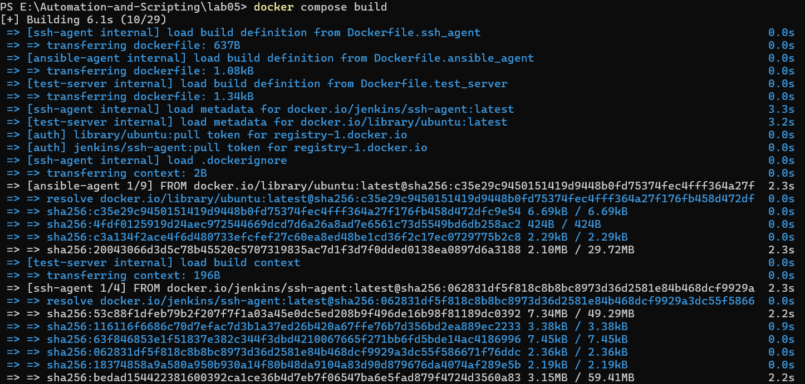
După build-ul cu succes, am pornit toate containerele cu `docker compose up -d`.
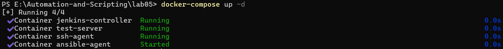
### Configurarea Credentialelor SSH în Jenkins

În interfața Jenkins, am navigat la secțiunea "Manage Jenkins" → "Manage Credentials" și am adăugat două credentiale SSH. Prima credențială a fost creată folosind cheia privată `jenkins_agent_ssh_key` pentru utilizatorul `jenkins`, necesară pentru conectarea la agentul SSH. A doua credențială a folosit cheia privată `jenkins_ansible_ssh_key` pentru utilizatorul `jenkins-ansible`, necesară pentru conectarea la agentul Ansible. Am setat strategia de verificare a cheii host la "Non verifying Verification Strategy" pentru a evita problemele cu known_hosts în containerele Docker.

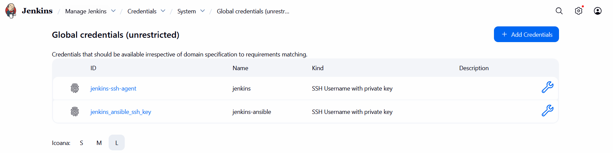

Am configurat primul nod permanent în Jenkins pentru agentul SSH cu următoarele setări: nume `php-agent`, remote root directory `/home/jenkins/agent`, label `php-agent`, launch method "Launch agents via SSH", host `ssh-agent`, credențialele SSH create anterior pentru utilizatorul `jenkins` și strategia de verificare a cheii host setată la "Non verifying Verification Strategy".

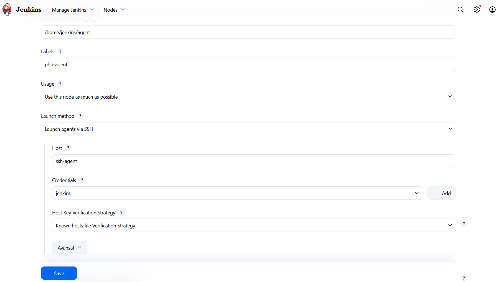

Al doilea nod a fost configurat pentru agentul Ansible cu setările: nume `ansible-agent`, remote root directory `/home/jenkins-ansible/agent`, label `ansible-agent`, launch method "Launch agents via SSH", host `ansible-agent`, credențialele SSH pentru utilizatorul `jenkins-ansible` și aceeași strategie de verificare a cheii host.

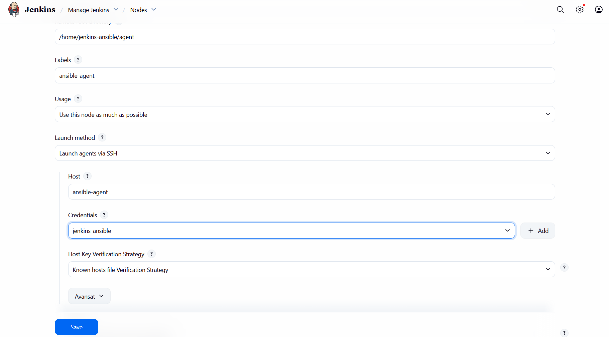

După configurarea nodurilor, am salvat configurațiile și Jenkins a început automat să se conecteze la agenții SSH și Ansible. Am verificat statusul conexiunilor în secțiunea "Manage Jenkins" → "Nodes" și am confirmat că ambii agenți erau conectați și disponibili pentru execuția job-urilor.

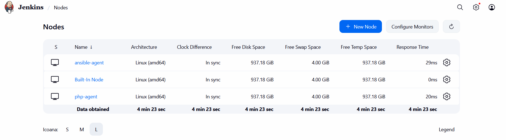

Am creat trei pipeline-uri în Jenkins de tip "Pipeline", fiecare folosind "Pipeline script" direct în interfața Jenkins (nu "Pipeline script from SCM"). Pentru fiecare pipeline, am copiat conținutul corespunzător din fișierele Groovy create anterior și am salvat configurația.

Primul pipeline `php-build-and-test` a fost rulat pe agentul SSH și a clonat cu succes repository-ul PHP, a instalat dependențele și a rulat testele unitare, generând raportul JUnit XML.

Al doilea pipeline `ansible-setup-server` a fost rulat pe agentul Ansible și a configurat cu succes serverul de test, instalând Apache, PHP, Composer și toate dependențele necesare.

Al treilea pipeline `php-deploy` a fost rulat pe agentul Ansible și a deployat cu succes aplicația PHP pe serverul de test, instalând dependențele Composer și configurând aplicația pentru rulare.

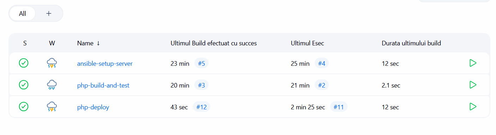

După rularea pipeline-ului de deploy, am accesat aplicația PHP la adresa `http://localhost:8082/app` și am verificat că funcționează corect. Aplicația este accesibilă și rulează pe serverul de test configurat automat.

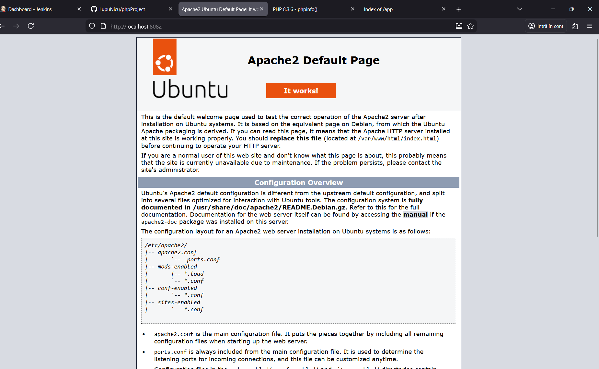

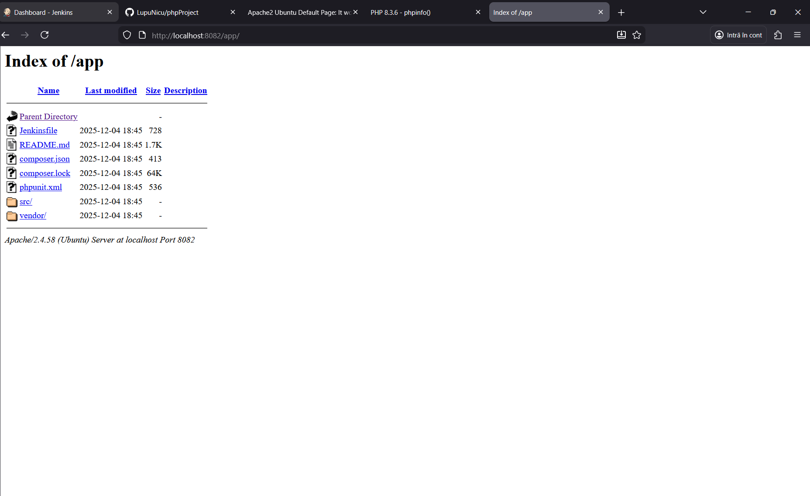

## Răspunsuri la Întrebări

1. Care sunt avantajele folosirii Ansible pentru configurarea serverului?

Avantajele principale ale folosirii Ansible pentru configurarea serverului sunt:

- **Idempotență**: Ansible permite rularea aceluiași playbook de multiple ori fără a produce efecte secundare nedorite. Dacă o configurație este deja aplicată, Ansible nu o va modifica.

- **Declarativitate**: Playbook-urile Ansible descriu starea dorită a sistemului, nu pașii specifici pentru a ajunge la acea stare. Acest lucru face codul mai ușor de înțeles și de întreținut.

- **Automatizare**: Ansible permite automatizarea completă a procesului de configurare, eliminând erorile umane și reducând timpul necesar pentru configurarea serverelor.

- **Versionare**: Playbook-urile Ansible pot fi versionate în Git, permițând urmărirea modificărilor și revenirea la versiuni anterioare dacă este necesar.

- **Reutilizabilitate**: Playbook-urile pot fi reutilizate pentru configurarea mai multor servere identice sau similare.

- **Integrare cu CI/CD**: Ansible se integrează perfect cu sistemele CI/CD precum Jenkins, permițând automatizarea completă a procesului de deployment.

- **Modularitate**: Ansible oferă o bibliotecă vastă de module pentru gestionarea diferitelor componente ale sistemului (pachete, servicii, fișiere, etc.).

### 2. Ce alte module Ansible există pentru managementul configurației?

Ansible oferă o gamă largă de module pentru managementul configurației:

- **Module pentru pachete**: `apt`, `yum`, `dnf`, `pip` pentru instalarea și gestionarea pachetelor
- **Module pentru servicii**: `systemd`, `service` pentru gestionarea serviciilor sistemului
- **Module pentru fișiere**: `copy`, `template`, `file`, `lineinfile` pentru gestionarea fișierelor
- **Module pentru utilizatori**: `user`, `group` pentru gestionarea utilizatorilor și grupurilor
- **Module pentru rețea**: `uri`, `get_url` pentru operații de rețea
- **Module pentru baze de date**: `mysql_db`, `postgresql_db` pentru gestionarea bazelor de date
- **Module pentru cloud**: Module pentru AWS, Azure, GCP pentru gestionarea resurselor cloud
- **Module pentru containere**: `docker_container`, `k8s` pentru gestionarea containerelor
- **Module pentru web servers**: `apache2_module`, `nginx` pentru configurarea serverelor web
- **Module pentru securitate**: `firewalld`, `ufw` pentru gestionarea firewall-urilor

### 3. Ce probleme ai întâmpinat la crearea playbook-ului Ansible și cum le-ai rezolvat?

În timpul implementării, am întâmpinat următoarele probleme și soluții:

**Problema 1: Apache nu pornește cu systemd în containere Docker**
- **Soluție**: Am înlocuit modulul `systemd` cu comanda `service apache2 start` și am adăugat verificări folosind `pgrep` pentru a confirma că Apache rulează.

**Problema 2: Permisiuni pentru copierea fișierelor cu rsync**
- **Soluție**: Am creat un director temporar deținut de utilizatorul `ansible` pentru copierea inițială, apoi am mutat fișierele în locația finală folosind `sudo` și am setat permisiunile corecte pentru `www-data`.

**Problema 3: Lipseau extensiile PHP necesare**
- **Soluție**: Am adăugat toate extensiile PHP necesare (`php-xml`, `php-curl`, `php-mbstring`) în playbook-ul de configurare și în pipeline-ul de deploy.

**Problema 4: Composer nu era instalat pe serverul de test**
- **Soluție**: Am adăugat instalarea Composer în playbook-ul de configurare și am adăugat verificare și instalare automată în pipeline-ul de deploy.

**Problema 5: Probleme cu known_hosts în containere**
- **Soluție**: Am configurat `StrictHostKeyChecking=no` și `UserKnownHostsFile=/dev/null` în comenzile SSH pentru a evita problemele cu known_hosts în containere.

**Problema 6: rsync nu era instalat**
- **Soluție**: Am adăugat `rsync` în Dockerfile-urile pentru `ansible-agent` și `test-server`.

**Problema 7: DNS resolution între containere**
- **Soluție**: Am adăugat `hostname` și `aliases` pentru toate serviciile în `compose.yaml` pentru a îmbunătăți rezolvarea DNS în Docker.

**Problema 8: Containerul ansible-agent se repornise continuu**
- **Soluție**: Am adăugat `CMD ["sh", "-c", "/usr/sbin/sshd -D & sleep infinity"]` în Dockerfile pentru a menține containerul rulând.

**Problema 9: Java nu era instalat în ansible-agent**
- **Soluție**: Am adăugat `openjdk-17-jre-headless` în lista de pachete instalate în Dockerfile-ul ansible-agent.

**Problema 10: Eroare la instalarea Ansible cu pip**
- **Soluție**: Am adăugat flag-ul `--break-system-packages` la comanda `pip3 install ansible` pentru a permite instalarea pe sistemele Ubuntu mai noi.

**Problema 11: Probleme cu permisiunile cheilor SSH**
- **Soluție**: Am setat permisiunile corecte (600 pentru cheia privată, 644 pentru cheia publică) direct în Dockerfile prin comenzi RUN, deoarece volume-urile montate erau read-only.

**Problema 12: Pipeline-ul nu găsea fișierele Groovy**
- **Soluție**: Am folosit "Pipeline script" direct în Jenkins în loc de "Pipeline script from SCM" și am copiat manual conținutul fișierelor Groovy.

**Problema 13: JUnit raportul nu era generat**
- **Soluție**: Am adăugat comanda pentru crearea directorului `tests/_output` și am specificat explicit opțiunea `--log-junit` în comanda PHPUnit.

**Problema 14: Composer nu găsea extensiile PHP**
- **Soluție**: Am adăugat explicit instalarea extensiilor PHP necesare (`php-mbstring`, `php-xml`, `php-curl`) în playbook-ul de configurare a aplicației.

## Concluzii

Această lucrare individuală a demonstrat implementarea unui sistem complet de CI/CD folosind Jenkins, Docker, Ansible și PHP. Infrastructura creată permite automatizarea completă a procesului de construire, testare și deployare a aplicațiilor PHP.

Soluția implementată este scalabilă, reutilizabilă și ușor de întreținut, folosind best practices pentru containerizare și automatizare. Playbook-urile Ansible oferă o modalitate declarativă și idempotentă de configurare a serverelor, iar pipeline-urile Jenkins asigură automatizarea completă a procesului de CI/CD.

Prin utilizarea Docker Compose, toate componentele sistemului pot fi pornite și oprite cu comenzi simple, facilitând dezvoltarea și testarea locală. Arhitectura cu agenți separați (SSH Agent pentru build și test, Ansible Agent pentru deployment) permite o separare clară a responsabilităților și o scalabilitate mai bună.

Procesul de rezolvare a problemelor întâmpinate a demonstrat importanța înțelegerii profunde a interacțiunilor între componentele sistemului și necesitatea adaptării soluțiilor la constrângerile specifice ale mediului containerizat.
